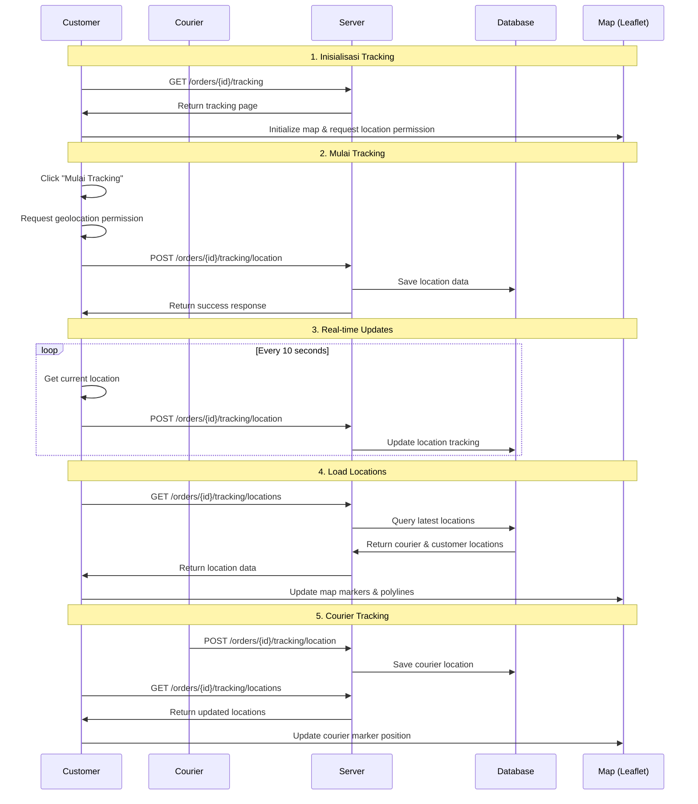

# Fitur Live Tracking dengan Leaflet.js

## Overview
Fitur Live Tracking memungkinkan pelacakan lokasi kurir dan customer secara real-time menggunakan peta interaktif dengan Leaflet.js. Fitur ini memberikan transparansi penuh kepada customer tentang perjalanan pengiriman mereka.

## Fitur Utama

### 1. **Real-time Location Tracking**
- Pelacakan lokasi kurir dan customer secara real-time
- Update lokasi setiap 10 detik saat tracking aktif
- Penyimpanan history lokasi untuk analisis rute

### 2. **Interactive Map dengan Leaflet.js**
- Peta interaktif menggunakan OpenStreetMap
- Custom markers untuk kurir (biru) dan customer (hijau)
- Polyline untuk menunjukkan rute perjalanan
- Auto-fit map untuk menampilkan semua markers

### 3. **Location Permission Management**
- Permintaan izin lokasi otomatis
- Alert jika izin lokasi ditolak
- Fallback untuk browser yang tidak mendukung geolocation

### 4. **User-friendly Interface**
- Tombol start/stop tracking yang intuitif
- Status lokasi real-time (Aktif/Tidak tersedia)
- Informasi terakhir update
- Kontrol untuk refresh dan center map

## Teknologi yang Digunakan

### Backend
- **Laravel 10**: Framework PHP
- **MySQL**: Database untuk menyimpan data tracking
- **LocationTracking Model**: Model untuk data lokasi
- **TrackingController**: Controller untuk API tracking

### Frontend
- **Leaflet.js 1.9.4**: Library peta interaktif
- **OpenStreetMap**: Provider tile peta
- **Vanilla JavaScript**: Logic tracking dan UI
- **Tailwind CSS**: Styling interface

## Database Schema

### Tabel `location_tracking`
```sql
- id (bigint, primary key)
- order_id (bigint, foreign key ke orders)
- user_id (bigint, foreign key ke users)
- user_type (string: 'courier' atau 'customer')
- latitude (decimal 10,8)
- longitude (decimal 11,8)
- accuracy (decimal 8,2, nullable)
- speed (decimal 8,2, nullable)
- heading (decimal 8,2, nullable)
- tracked_at (timestamp)
- created_at (timestamp)
- updated_at (timestamp)
```

## API Endpoints

### 1. **GET /orders/{order}/tracking**
- Menampilkan halaman tracking
- Access: Customer, Courier, Admin yang terkait dengan order

### 2. **POST /orders/{order}/tracking/location**
- Update lokasi user saat ini
- Body: `{latitude, longitude, accuracy, speed, heading}`
- Access: User yang terkait dengan order

### 3. **GET /orders/{order}/tracking/locations**
- Mendapatkan data lokasi terbaru
- Response: `{courier_location, customer_location, tracking_history}`
- Access: User yang terkait dengan order

### 4. **POST /orders/{order}/tracking/start**
- Memulai tracking untuk order
- Access: User yang terkait dengan order

## Alur Tracking



## Cara Penggunaan

### Untuk Customer
1. Buka halaman detail pesanan
2. Klik tombol "Live Tracking" (tersedia untuk status: assigned, picked_up, in_transit, awaiting_confirmation)
3. Berikan izin lokasi saat diminta
4. Klik "Mulai Tracking" untuk mulai berbagi lokasi
5. Lihat pergerakan kurir di peta secara real-time

### Untuk Courier
1. Buka halaman detail pesanan di dashboard kurir
2. Klik "Buka Live Tracking"
3. Berikan izin lokasi saat diminta
4. Klik "Mulai Tracking" untuk mulai berbagi lokasi
5. Customer dapat melihat pergerakan Anda di peta

## Keamanan dan Privacy

### Access Control
- Hanya customer, courier, dan admin yang terkait dengan order yang dapat mengakses tracking
- Validasi user permission di setiap endpoint
- CSRF protection untuk semua POST requests

### Data Privacy
- Data lokasi hanya disimpan untuk 24 jam terakhir
- Tidak ada data lokasi yang disimpan untuk order yang sudah selesai
- User dapat menghentikan tracking kapan saja

## Performance Optimization

### Database
- Index pada `(order_id, user_id, tracked_at)` untuk query yang cepat
- Scope `recent()` untuk membatasi data ke 24 jam terakhir
- Limit 50 data terbaru untuk tracking history

### Frontend
- Update lokasi setiap 10 detik (dapat disesuaikan)
- Auto-refresh data setiap 30 detik
- Efficient marker dan polyline management
- Lazy loading untuk data tracking history

## Browser Compatibility

### Supported Browsers
- Chrome 50+
- Firefox 45+
- Safari 10+
- Edge 12+

### Required Features
- HTML5 Geolocation API
- ES6 JavaScript support
- CSS3 support untuk styling

## Testing

### Manual Testing
1. Jalankan seeder: `php artisan db:seed --class=LocationTrackingSeeder`
2. Buat order dengan status yang sesuai
3. Test tracking sebagai customer dan courier
4. Verifikasi data tersimpan di database

### Test Data
Seeder akan membuat data tracking untuk 5 order dengan:
- 10 lokasi kurir (simulasi perjalanan)
- 3 lokasi customer (lokasi tujuan)
- Data dalam 24 jam terakhir

## Troubleshooting

### Common Issues

1. **Location permission denied**
   - Pastikan browser mengizinkan akses lokasi
   - Check HTTPS requirement untuk geolocation

2. **Map tidak muncul**
   - Check koneksi internet untuk load tile OpenStreetMap
   - Verify Leaflet.js library ter-load dengan benar

3. **Tracking tidak update**
   - Check console browser untuk error JavaScript
   - Verify API endpoint dapat diakses
   - Check CSRF token valid

4. **Performance issues**
   - Reduce update frequency jika diperlukan
   - Check database query performance
   - Monitor memory usage untuk polyline data

## Future Enhancements

### Planned Features
1. **Route Optimization**: Saran rute terbaik untuk kurir
2. **ETA Calculation**: Estimasi waktu tiba berdasarkan traffic
3. **Geofencing**: Notifikasi otomatis saat kurir mendekati tujuan
4. **Offline Support**: Cache peta untuk area yang sering dikunjungi
5. **Push Notifications**: Notifikasi real-time untuk update lokasi
6. **Analytics Dashboard**: Statistik tracking dan performance

### Technical Improvements
1. **WebSocket Integration**: Real-time updates tanpa polling
2. **Map Clustering**: Group markers untuk area dengan banyak lokasi
3. **Custom Map Styles**: Tema peta yang dapat disesuaikan
4. **Mobile App Integration**: API untuk mobile app
5. **Batch Location Updates**: Optimasi untuk multiple location updates

## Maintenance

### Regular Tasks
1. **Database Cleanup**: Hapus data tracking lama (> 30 hari)
2. **Performance Monitoring**: Monitor query performance dan response time
3. **Error Logging**: Monitor error rate dan user feedback
4. **Security Updates**: Update Leaflet.js dan dependencies

### Monitoring
- Track API response times
- Monitor database query performance
- Check error rates untuk geolocation API
- Monitor user engagement dengan fitur tracking

## Support

Untuk pertanyaan atau masalah terkait fitur Live Tracking, silakan hubungi tim development atau buat issue di repository project.
